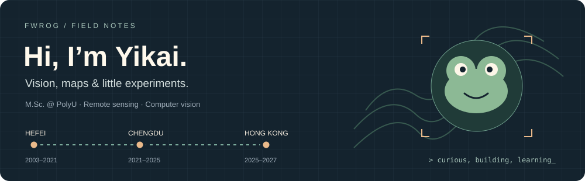

  <a href="https://fwrog.github.io/">Website</a> ·
  <a href="mailto:yi-kai.wu@connect.polyu.hk">Email</a> ·
  <a href="https://www.researchgate.net/profile/Yikai-Wu-3">ResearchGate</a> ·
  <a href="https://orcid.org/0009-0004-2501-7877">ORCID</a>

### 🐸 A little about me

I’m **Yikai Wu / 吴艺楷**, an M.Sc. student at **The Hong Kong Polytechnic University**. I work with images, depth and geospatial data—and enjoy turning research tasks into useful little tools.

- 🔬 **Working on:** multi-view RGB-D defect measurement and urban street-view analysis.
- 🌍 **Interested in:** remote sensing, computer vision and multimodal perception.
- 🎬 **A side project:** exploring Hong Kong through its film locations.

### 🛠️ Things I’m building

| Project | What you’ll find |
| :--- | :--- |
| 🌍 **[gee-agent-skill](https://github.com/Fwrog/gee-agent-skill)** | AI-assisted Earth Engine workflows: plan, generate, validate and trace. Includes NDVI examples and product-comparison reports. **Python · GEE** |
| 🎬 **[HKFilmMap](https://github.com/Fwrog/HKFilmMap)** | A Hong Kong film-location explorer with maps, scene check-ins and route planning. **Java · Android · SQLite** |
| 🧭 **[Personal website](https://github.com/Fwrog/Fwrog.github.io)** | Research, projects, campus life and the places along the way. **Jekyll · English / 中文** |

### 🧰 On my workbench

**Vision** &nbsp; OpenCV · RGB-D · YOLO · NeRF  
**Geospatial** &nbsp; Google Earth Engine · GIS · HLS · FLUXNET  
**Code** &nbsp; Python · MATLAB · Java · C/C++ · Git

中文 · 关于我

你好，我是吴艺楷，目前在香港理工大学攻读城市信息学与智慧城市硕士，本科就读于西南交通大学遥感科学与技术专业。

我关注遥感、计算机视觉和多模态感知，目前在做多视角 RGB-D 缺陷量测与城市街景分析。也喜欢写一些地图应用和研究工具，比如香港电影取景地地图，以及辅助 Earth Engine 分析的 skill。

合肥（2003–2021）→ 成都（2021–2025）→ 香港（2025–2027）。更多研究与校园生活见[个人主页](https://fwrog.github.io/zh/)。

---
📍 Hong Kong · Happy to chat about maps, vision, or something you’re building.
